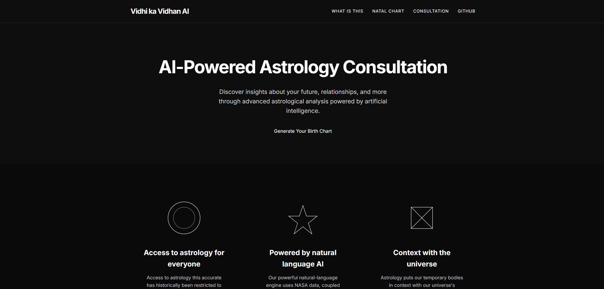

# Vidhi ka Vidhan AI: AI-Powered Astrology Consultation

An AI-powered astrology consultation web application built with Flask and modern AI technologies.

[](https://www.loom.com/share/9b7281b15c9248da9e6065183268dc3c)
<!--  -->

## Features

- Generate accurate natal charts based on birth details
- Perform astrological calculations using NASA ephemeris data
- Ask questions and receive personalized astrological insights
- AI-powered responses from a professional "astrologer" perspective
- Real-time web search for up-to-date astrological information
- Memory components to maintain context during consultation sessions
- Clean, minimal UI with intuitive user flows

## Technologies Used

- **Backend**: Python Flask
- **AI Integration**: Langchain with Cerebras
- **Astrological Calculations**: pyswisseph
- **Web Search**: Tavily API
- **Frontend**: HTML, CSS, JavaScript
- **Data Visualization**: SVG

## Installation

1. Clone the repository:
   ```
   git clone https://github.com/yourusername/astrology-ai.git
   cd astrology-ai
   ```

2. Create and activate a virtual environment:
   ```
   python -m venv venv
   source venv/bin/activate  # On Windows: venv\Scripts\activate
   ```

3. Install dependencies:
   ```
   pip install -r requirements.txt
   ```

4. Create a `.env` file in the root directory with your API keys:
   ```
   SECRET_KEY=your_secret_key
   CEREBRAS_API_KEY=your_cerebras_api_key
   TAVILY_API_KEY=your_tavily_api_key
   ```

## Usage

1. Start the Flask application:
   ```
   python run.py
   ```

2. Open your browser and navigate to `http://localhost:5000`

3. Enter your birth details to generate your natal chart

4. Ask questions to receive personalized astrological insights

## Development

### Project Structure

```
astrology-ai/
├── app.py                    # Main Flask application
├── astro_utils.py            # Astrological calculation utilities
├── llm_utils.py              # LLM and search utilities
├── requirements.txt          # Project dependencies
├── .env                      # Environment variables (not in repo)
├── static/                   
│   ├── css/                 
│   │   └── style.css        # Styling
│   ├── js/                  
│   │   └── main.js          # Client-side functionality
│   └── images/              # Images and icons
└── templates/                
    ├── base.html            # Base template
    ├── index.html           # Home page
    ├── about.html           # About page
    ├── natal-chart.html     # Natal chart display
    └── consultation.html    # Consultation interface
```

## API Endpoints

- `POST /api/generate-chart` - Generate a natal chart from birth details
- `POST /api/ask-question` - Submit a question to the AI astrologer
- `GET /api/get-readings` - Retrieve previous readings

## Contributing

Contributions are welcome! Please feel free to submit a Pull Request.

## License

This project is licensed under the MIT License - see the LICENSE file for details.

## Acknowledgements

- [pyswisseph](https://github.com/astrorigin/pyswisseph) for astrological calculations
- [Langchain](https://github.com/langchain-ai/langchain) for the LLM pipeline
- [Tavily](https://tavily.com/) for web search capabilities 
